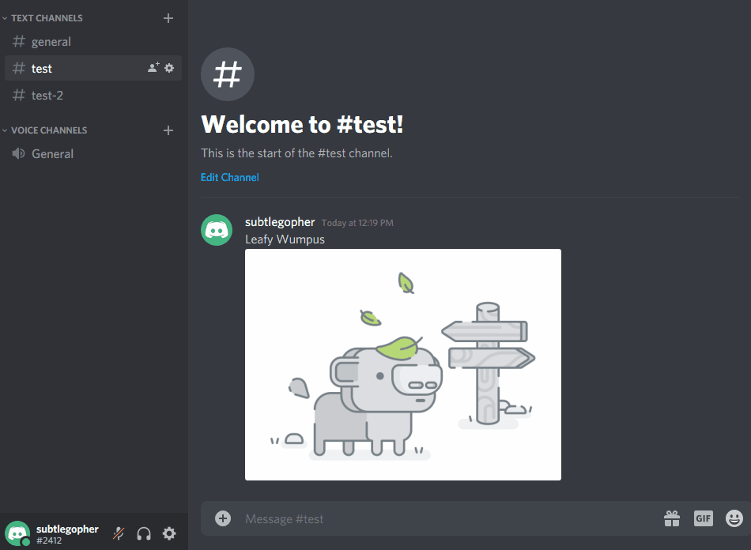

# Previewer



Previewer is a simple bot written for Discord that allows previewing linked messages. 
Current behavior requires clicking the message link in order to view it. Previewer
takes care of this for you by automatically giving you a peek of what the linked message contains, saving
you the hassle.

## Features
- previewing messages along with images and attachments in embeds
- linked message metadata, such as author and time sent.
- automatic blocking of previews in private channels

## Installation
Previewer requires Go 1.13.X and a Discord API token to run.

```
git clone https://github.com/pixeltopic/previewer.git
```

```
go build
./previewer -t <discord bot token>
```